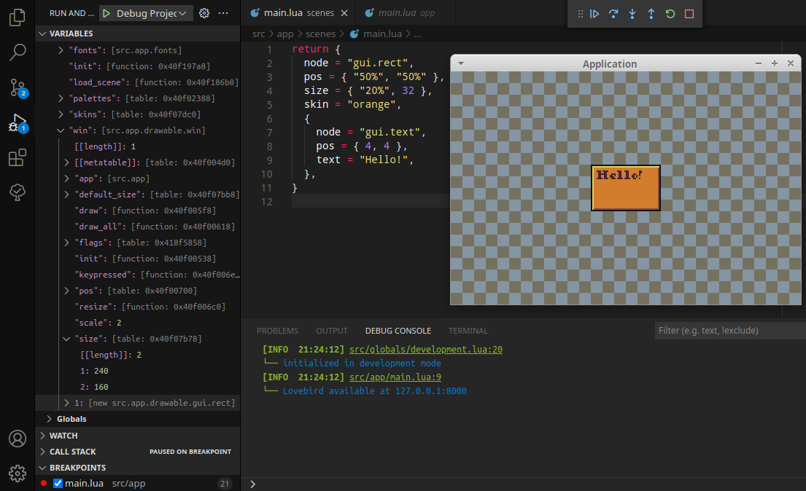

# LÖVE-template (WIP)

Pixel-style game template based on [LÖVE][] engine.

## Features (current and planned)

- Pixel-perfect and tile-based:
  - [x] Scaling
  - [ ] GUI
- Multiplayer:
  - [ ] Server
    - [ ] Database (sqlite?)
    - [ ] Communications (enet?)
      - [ ] Authorization
      - [ ] Lobby and chat
  - [ ] Tic-tac-toe ranking game
- Additional:
  - [x] Full documentation (sumneko-[lsp][])
  - [x] Very simple but powerful prototype-based OOP
  - [x] Preconfigured vscode-[debugger][]
  - [x] Advanced logging and debugging libs
  - [x] Palette and batching helpers
  - [ ] Easy import grids and animations from [libresprite][]

## Pre-requirements

- love >11
- lua >5 or luajit >2
- luarocks >3

## Installation

- Fork this repo
- Clone your fork
- Install dependencies: `lua run/install.lua`
- Update submodules: `lua run/update.lua`

## Agreements

- Use formatters: [stylua][] for lua and [prettier][] for everything else
- Use [luacheck] and [lsp] for errors detection
- Prototypes must be named in CamelCase
- Other variables must be named in snake_case
- Start comments with capital letter and finish with dot

[löve]: https://love2d.org
[stylua]: https://github.com/johnnymorganz/stylua
[prettier]: https://github.com/prettier/prettier
[luacheck]: https://github.com/mpeterv/luacheck
[lsp]: https://github.com/sumneko/lua-language-server
[debugger]: https://github.com/tomblind/local-lua-debugger-vscode
[libresprite]: https://libresprite.github.io
